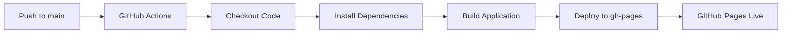

# Deployment Documentation

This document provides instructions for deploying the Bridge 4 Flight Map application to GitHub Pages.

## Overview

The application is configured to be deployed to GitHub Pages using GitHub Actions for continuous deployment. Every push to the `main` branch automatically triggers a build and deployment.

## Prerequisites

1. GitHub repository with GitHub Pages enabled
2. Node.js 18+ installed locally for testing
3. Write access to the repository

## Configuration

### Base Path

The application is configured with a base path for GitHub Pages:

**vite.config.js:**
```javascript
export default defineConfig({
  base: '/bridge-4-flight-map/',
  // ...
})
```

⚠️ **Important:** Adjust the base path to match your repository name if different.

### Environment Variables

Create a `.env` file based on `.env.example`:

```bash
cp .env.example .env
```

For production deployment, set environment variables in GitHub repository settings:
- `Settings` → `Secrets and variables` → `Actions`
- Add production-specific variables if needed

## Manual Deployment

### Step 1: Build the Application

```bash
# Install dependencies
npm install

# Build for production
npm run build
```

This creates an optimized build in the `dist/` directory.

### Step 2: Test the Build Locally

```bash
# Preview the production build
npm run preview
```

Visit `http://localhost:4173/bridge-4-flight-map/` to test the build.

### Step 3: Deploy to GitHub Pages

Using the GitHub Pages deploy script:

```bash
# Install gh-pages package
npm install --save-dev gh-pages

# Add deploy script to package.json
{
  "scripts": {
    "deploy": "gh-pages -d dist"
  }
}

# Deploy
npm run deploy
```

This pushes the `dist/` directory to the `gh-pages` branch.

## Automated Deployment with GitHub Actions

### Setup GitHub Actions

The repository includes a GitHub Actions workflow for automated deployment.

**File:** `.github/workflows/deploy.yml`

### GitHub Pages Settings

1. Go to your repository on GitHub
2. Navigate to `Settings` → `Pages`
3. Under "Source", select:
   - **Branch:** `gh-pages`
   - **Folder:** `/ (root)`
4. Click "Save"

### Workflow Triggers

The deployment workflow runs:
- On every push to the `main` branch
- On manual workflow dispatch
- On pull request to `main` (build only, no deploy)

### Deployment Process



### Monitoring Deployments

1. Go to the `Actions` tab in your repository
2. View the latest workflow run
3. Check for any errors in the logs
4. Once completed, visit your GitHub Pages URL

**URL Format:** `https://<username>.github.io/<repository-name>/`

**Example:** `https://gumbotron.github.io/bridge-4-flight-map/`

## Custom Domain (Optional)

### Setup Custom Domain

1. Purchase a domain from a registrar
2. Configure DNS records:

```
Type: CNAME
Name: bridge4
Value: <username>.github.io
```

3. In GitHub repository settings:
   - `Settings` → `Pages` → `Custom domain`
   - Enter your domain: `bridge4.yourdomain.com`
   - Save

4. Update `vite.config.js`:

```javascript
export default defineConfig({
  base: '/', // Use root path for custom domain
  // ...
})
```

5. Add a `CNAME` file to the `public/` directory:

```
bridge4.yourdomain.com
```

### SSL Certificate

GitHub Pages automatically provides SSL for custom domains:
- Enable "Enforce HTTPS" in Pages settings
- Certificate provisioning takes ~24 hours

## Deployment Checklist

Before deploying to production:

- [ ] All tests passing locally
- [ ] `npm run build` completes successfully
- [ ] `npm run preview` works as expected
- [ ] Environment variables configured
- [ ] Base path matches repository name
- [ ] `.gitignore` excludes build artifacts
- [ ] README.md updated with correct URLs
- [ ] Data files present in `public/data/`
- [ ] Data files under 500MB total
- [ ] All dependencies up to date
- [ ] Security vulnerabilities resolved
- [ ] Legal disclaimers in place
- [ ] Attribution for data sources included

## Rollback Procedure

If a deployment fails or introduces bugs:

### Option 1: Revert the Commit

```bash
# Revert the last commit
git revert HEAD

# Push to main
git push origin main

# GitHub Actions will redeploy automatically
```

### Option 2: Deploy Previous Version

```bash
# Checkout previous working commit
git checkout <commit-hash>

# Force deploy (if using gh-pages)
npm run deploy
```

### Option 3: Manual Branch Reset

```bash
# Reset gh-pages to previous state
git checkout gh-pages
git reset --hard <previous-commit-hash>
git push --force origin gh-pages
```

## Troubleshooting

### Build Fails

**Issue:** `npm run build` fails

**Solutions:**
- Check Node.js version (18+ required)
- Clear `node_modules` and reinstall: `rm -rf node_modules && npm install`
- Check for TypeScript/linting errors
- Review build logs for specific errors

### 404 Errors After Deployment

**Issue:** Application loads but shows 404 errors

**Solutions:**
- Verify base path in `vite.config.js` matches repository name
- Check GitHub Pages source is set to `gh-pages` branch
- Ensure `index.html` is in root of `gh-pages` branch
- Clear browser cache

### Assets Not Loading

**Issue:** Images, CSS, or JS files return 404

**Solutions:**
- Verify assets are in `public/` directory or imported correctly
- Check base path is correctly prepended to all asset URLs
- Inspect browser network tab for actual URLs being requested
- Ensure case-sensitive file names match

### Deployment Takes Too Long

**Issue:** GitHub Actions deployment exceeds time limits

**Solutions:**
- Reduce data file sizes in `public/data/`
- Split large GeoJSON files by region
- Use shallow git clones in workflow
- Optimize dependencies (remove unused packages)

### GitHub Pages Not Updating

**Issue:** New deployment doesn't reflect changes

**Solutions:**
- Check GitHub Actions workflow completed successfully
- Wait 1-2 minutes for CDN propagation
- Clear browser cache (Ctrl+Shift+R)
- Check if GitHub Pages is enabled in repository settings
- Verify `gh-pages` branch has new commits

## Performance Optimization

### Build Optimization

```javascript
// vite.config.js
export default defineConfig({
  build: {
    rollupOptions: {
      output: {
        manualChunks: {
          'react-vendor': ['react', 'react-dom'],
          'map-vendor': ['leaflet', 'react-leaflet']
        }
      }
    },
    chunkSizeWarningLimit: 1000
  }
})
```

### Asset Optimization

- Compress images: Use WebP format
- Minify GeoJSON: Remove unnecessary properties
- Enable gzip: Automatic on GitHub Pages
- Use CDN for Leaflet: Already configured in `index.html`

### Caching Strategy

GitHub Pages automatically sets cache headers:
- HTML: No cache (always fresh)
- Assets: 1 year cache (versioned filenames)

## Monitoring

### Analytics (Optional)

Add Google Analytics or similar:

```html
<!-- index.html -->
<head>
  <!-- ... -->
  <script async src="https://www.googletagmanager.com/gtag/js?id=G-XXXXXXXXXX"></script>
  <script>
    window.dataLayer = window.dataLayer || [];
    function gtag(){dataLayer.push(arguments);}
    gtag('js', new Date());
    gtag('config', 'G-XXXXXXXXXX');
  </script>
</head>
```

### Error Tracking (Optional)

Integrate Sentry for error tracking:

```bash
npm install @sentry/react
```

```javascript
// main.jsx
import * as Sentry from "@sentry/react";

Sentry.init({
  dsn: "YOUR_SENTRY_DSN",
  environment: "production"
});
```

## Maintenance

### Regular Updates

- **Weekly:** Check GitHub Actions runs
- **Monthly:** Update dependencies
- **Quarterly:** Review and update data files
- **Annually:** Security audit

### Update Process

```bash
# Check for outdated packages
npm outdated

# Update dependencies
npm update

# Test thoroughly
npm run dev
npm run build
npm run preview

# Commit and push
git add package.json package-lock.json
git commit -m "Update dependencies"
git push origin main
```

## Security

### HTTPS

- Always use HTTPS URLs
- Enforce HTTPS in GitHub Pages settings
- Update all external resource URLs to HTTPS

### Content Security Policy

Add CSP headers (requires custom server or Cloudflare):

```html
<meta http-equiv="Content-Security-Policy" 
      content="default-src 'self'; 
               script-src 'self' 'unsafe-inline' https://unpkg.com; 
               style-src 'self' 'unsafe-inline' https://unpkg.com;
               img-src 'self' data: https:;
               connect-src 'self' https:;">
```

### API Keys

If using external APIs:
- Never commit API keys to repository
- Use GitHub Secrets for sensitive data
- Restrict API keys to specific domains
- Rotate keys regularly

## Cost Considerations

### GitHub Pages (Free Tier)
- **Storage:** 1GB
- **Bandwidth:** 100GB/month
- **Build time:** 10 minutes/job
- **Limit:** 10 deployments/hour

### If Exceeding Limits
- Consider GitHub Pages Pro
- Use Netlify or Vercel (free tiers available)
- Self-host on VPS
- Use CDN for large assets

## Alternative Deployment Options

### Netlify

```bash
# Install Netlify CLI
npm install -g netlify-cli

# Deploy
netlify deploy --prod --dir=dist
```

### Vercel

```bash
# Install Vercel CLI
npm install -g vercel

# Deploy
vercel --prod
```

### Self-Hosted

```bash
# Build
npm run build

# Copy dist/ to web server
scp -r dist/* user@server:/var/www/bridge4/
```

## Support

For deployment issues:
1. Check GitHub Actions logs
2. Review GitHub Pages status: https://www.githubstatus.com/
3. Consult GitHub Pages documentation
4. Open an issue in the repository

---

**Last Updated:** 2025-10-24  
**Next Review:** 2026-01-24
